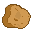

#  Nugget Game

**Nugget Game** is a 2D platform physics puzzle game for Windows and Linux. Solve the puzzles to reach the sauce at
the end of each level.

## 🏗️ Structure

This repository contains the following subdirectories:

- [Assets](Assets) - Source game assets such as sprites, audio, levels, etc...
- [Core](Core) - Game engine library source
- [Game](Game) - Nugget Game source
- [Lib](Lib) - Third party libraries
- [Packer](Packer) - Asset packing and unpacking source

## 📚 Dependencies

Nugget Game relies on the following third party libraries to compile successfully:

- [GLFW3](https://www.glfw.org/)
- [box2d](https://box2d.org/)
- [LZ4](https://github.com/lz4/lz4)
- [glm](https://github.com/g-truc/glm)
- [glad](https://glad.dav1d.de/)
- [stb_image](https://github.com/nothings/stb/blob/master/stb_image.h)
- [fmt](https://github.com/fmtlib/fmt)
- [OpenAL Soft](https://github.com/kcat/openal-soft)
- [RmlUi](https://github.com/mikke89/RmlUi)

These should be installed via [vcpkg]() for the smoothest build chain setup process.

## ℹ️ Contributions

Nugget Game is open to the public for viewing, modifying, and borrowing the core engine code (found in [Core](Core). The
project itself
is not accepting contributions, however. Please do not submit pull requests as they will immediately be
closed. Issues are more than welcome. See the [license](LICENSE.md) for more details.